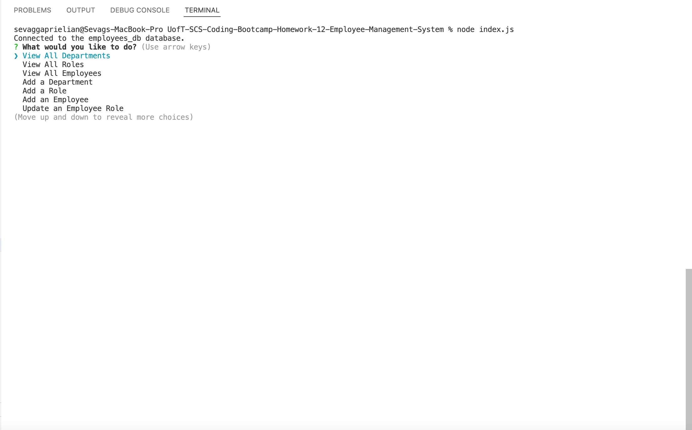
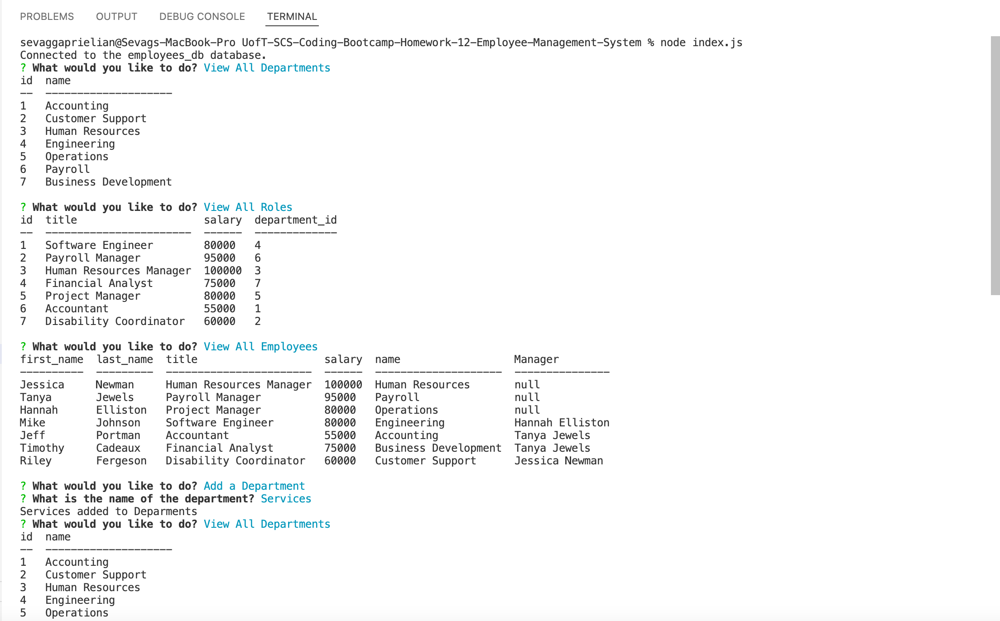

# UofT-SCS-Coding-Bootcamp-Homework-12-Employee-Management-System

## Table of Contents
* [Description](#desc)  
* [Installation](#install)  
* [Usage](#usage)  
* [Credits](#credits)  
* [License](#license)  
* [Github](#github)  

## Description

Developers frequently have to create interfaces that allow non-developers to easily view and interact with information stored in databases. These interfaces are called content management systems (CMS). The purpose of this project was to build a command-line application from scratch to manage a company's employee database using Node.js, Inquirer, and MySQL.

## Installation
Clone the repository, and input your MySQL password in the indicated location in the index.js file. Run npm install to install the necessary Inquirer, console.table, and mysql2 packages. Once complete run the node index.js commands to start the application.s
 
 
## Usage
The following image shows the application's appearance and functionality.

The application should appear as follows after running the node index.js command:

The application should appear as follows after selecting the View All Departments, View All Roles, and View All Employees options:

 
## Credits
Uoft SCS Coding Bootcamp Gitlab

 
## License
Copyright [2021] [Sevag Gaprielian]

Licensed under the Apache License, Version 2.0 (the "License"); you may not use this file except in compliance with the License.
You may obtain a copy of the License at http://www.apache.org/licenses/LICENSE-2.0.

Unless required by applicable law or agreed to in writing, software
distributed under the License is distributed on an "AS IS" BASIS,
WITHOUT WARRANTIES OR CONDITIONS OF ANY KIND, either express or implied.
See the License for the specific language governing permissions and
limitations under the License.

 
## GitHub
Github: sevaggap  
Walkthrough Video: https://drive.google.com/file/d/16Z1aEwFRY_KSgYRmxj2AXLqkOHLoAhCX/view?usp=sharing